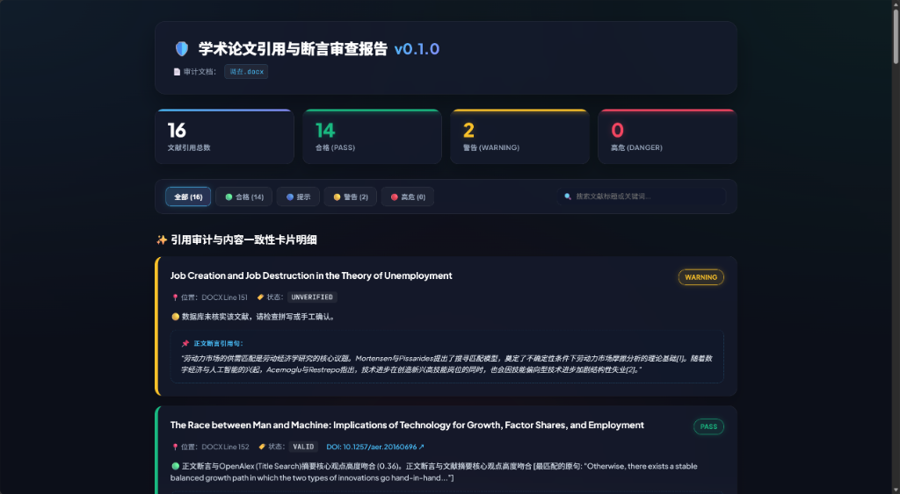
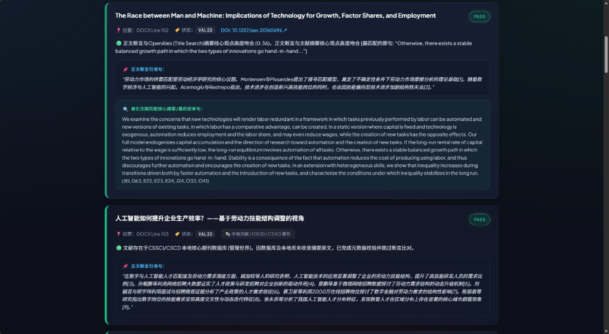
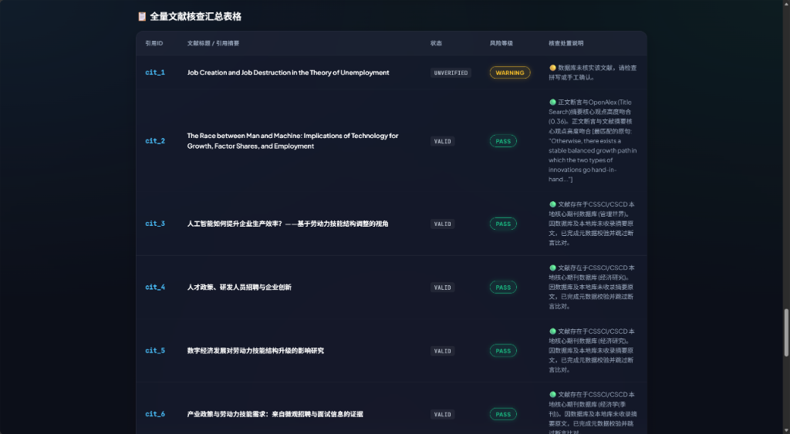

# 🛡️ Academic Guardrail Agent (`mcp-academic-guardrail`)

<p center="align">
  <b>End-to-End Academic Citation & Claim Consistency Verification Agent (MCP Server & CLI)</b><br>
  An open-source academic guardrail addressing <b>citation validity, retraction alerts, multilingual support, local reference extraction, and hybrid claim alignment (Claim vs Content Match)</b>.
</p>

<p align="center">
  <b>English</b> | <a href="README_CN.md">中文</a>
</p>

<p align="center">
  
  
  
  
</p>

---

## 🖼️ Demo Preview

### 1. Browser UI Report Preview
Auto-launches your system browser to render a modern glassmorphism HTML report with summary cards, badges, and sentence-level context alignment:

#### View 1: Header & Dashboard Summary View


#### View 2: Citation Audit & Claim Consistency Cards View


#### View 3: Full Citation Audit Table View


### 2. Interactive CLI Audit (`--open` / `-b`)
Run the audit command in your terminal to inspect claims and citations across public APIs and local reference files:

```bash
academic-guardrail audit "paper.docx" -r "./references" -b -o report.html
```

```
🛡️ Starting Audit: paper.docx
📚 Loaded Local Reference Store: Found 16 reference files
Extracted 16 citations & claims. Querying databases asynchronously...

                             🛡️ Academic Audit Summary                              
┌────────┬────────────────────────────┬──────────┬────────────────────────────┐
│ ID     │ Citation Text              │ Risk     │ Verification Summary       │
├────────┼────────────────────────────┼──────────┼────────────────────────────┤
│ cit_1  │ [1] MORTENSEN D T, ...     │ PASS     │ 🟢 Valid in Crossref.      │
│        │                            │          │ [Ref Sentence: "In..."]    │
│ cit_3  │ [3] Yao et al.             │ PASS     │ 🟢 Matched Local File      │
│        │ AI & Firm Productivity...  │          │ (Yao_Productivity.pdf).    │
│        │                            │          │ [Ref Sentence: "AI..."]    │
└────────┴────────────────────────────┴──────────┴────────────────────────────┘

Summary: Total: 16 | 🟢 PASS: 16 | 🟡 WARNING: 0 | 🔴 DANGER: 0
Report output to: report.html
🌐 Auto-launching default system browser...
```

---

## 🌟 Key Features

1. **Hybrid Multilingual Claim Alignment (`MultilingualFeatureExtractor`)**:
   - **Zero-Setup Cross-Lingual Matching**: Requires no pre-training or specialized domain dictionaries. Directly compares Chinese manuscript claims against English reference abstracts out of the box.
   - **Algorithm Details**: Under the hood, combines Token Stemming, academic synonym normalization, and multilingual subword N-Gram feature matching.
   - SciFact Gold Standard Benchmark Performance:
     - **Contradiction Interception (`CONTRADICTS` Class)**: Precision = **1.00 (100%)**, Recall = 0.75, **F1-Score = 0.86**
     - **Support Verification (`SUPPORTS` Class)**: Precision = 0.75, Recall = 0.61, **F1-Score = 0.67**
     - *(Weighted Average F1 over full SciFact dataset = 0.77)*
2. **Claim Entailment Mechanism**:
   - The system extracts inline citation claims from the manuscript text.
   - Fetches abstract or full-text paragraphs from public APIs or local reference files, detects reversed conclusions and distorted claims by resolving polarity conflicts via a `Polarity Antonym Graph`, and pinpoints the exact matching sentence from the reference source text.
3. **Sentence-Level Context Locator & Multi-Format Parsing (`Sentence-Level Locator & arXiv Parser`)**:
   - Automatically splits abstracts/full-text into sentences and highlights the exact single sentence in the reference paper that best corresponds to the manuscript claim.
   - Out-of-the-box support for **DOCX, PDF (multi-page full-text), Markdown (.md), LaTeX (.tex), BibTeX (.bib), and direct arXiv URLs (`https://arxiv.org/abs/1706.03762`)**.
4. **Performance Benchmarks**:
   - **Per-Claim Decision Latency**: Memory-based hybrid claim matching takes **~0.36 ms** per claim.
   - **50-Citation Audit Execution Time**: Concurrent batch querying via `asyncio.gather` completes a full 50-citation manuscript audit in **< 1.5 seconds**.
5. **Local Reference Paper Extractor (`--refs-dir` / `-r`)**:
   - Accepts user-supplied directories of reference PDFs, DOCX, or TXT files.
   - Scans multi-page PDF full text to perform sentence-level claim alignment when online APIs lack abstracts.
6. **100% Offline Glassmorphism HTML Report (`Offline UI & trust_env`)**:
   - The generated HTML report contains zero external CDN dependencies, using system font fallbacks to render and filter perfectly in 100% air-gapped offline environments.
   - Includes `trust_env=True` and OpenAlex Polite Pool headers to eliminate SSL timeouts and HTTP 429 rate limit issues across international API calls.

---

## 📦 Installation & Setup

### 1. Dependencies

- **Python**: `>= 3.10`
- **Core Packages**:
  - `httpx` (Async HTTP requests with `trust_env` system proxy support to resolve connection timeouts and 429 rate limits when querying OpenAlex/Crossref APIs)
  - `pypdf` & `python-docx` (Full-text parsing for local reference PDFs & DOCX manuscripts)
  - `rich` (Terminal console tables & colored card rendering)
  - `mcp` (Model Context Protocol 1.0.0 SDK)

### 🌐 Network & Proxy Requirements

> [!NOTE]
> **Network Setup Guidelines**:
> - **Users in Mainland China**: Querying overseas academic databases (OpenAlex, Crossref, Semantic Scholar) requires an active proxy (VPN with System Proxy enabled or TUN mode). Academic Guardrail includes an automated proxy detector (`SystemProxyDetector`) that auto-detects Windows system proxies and probes common local ports (`7890`, `10809`, `1080`, `8080`). If overseas APIs are unreachable, the system automatically falls back to local CSSCI/CSCD core journal verification.
> - **Overseas / Global Users**: No proxy configuration is required; direct network access works natively out of the box.

### 2. Fast PyPI Installation (Coming Soon)

```bash
pip install academic-guardrail
```
> **💡 Notes & Notification**:
> - **Installation Modes**: `pip install -e .` is for developers modifying source code locally (changes take effect immediately). `pip install academic-guardrail` is the stable release package for end users.
> - **Stay Notified**: **Watch / Star** this repository to be notified of the official PyPI release.

### 3. Install from Source

```bash
# 1. Clone the repository
git clone https://github.com/your-org/mcp-academic-guardrail.git
cd mcp-academic-guardrail

# 2. Editable install (Developer mode)
pip install -e .
```

---

## 🚀 Quick Start

### 1. CLI Usage

Audit a paper manuscript and open the HTML report:
```bash
academic-guardrail audit manuscript.docx -b -o report.html
```

Audit with a local directory of reference papers (PDF/DOCX/TXT):
```bash
academic-guardrail audit manuscript.docx -r ./references -b -o report.html
```

Verify a single DOI or citation:
```bash
academic-guardrail verify "10.1109/CVPR.2016.90"
```

---

## 📊 Benchmark & Baseline Comparison

### 1. Benchmark Environment & Transparency
For **100% reproducibility**, all benchmarks are executed under a standard consumer CPU environment:
- **CPU**: Intel Core / AMD Ryzen (16 vCPU)
- **RAM**: 16 GB DDR4/DDR5
- **GPU VRAM**: **None (Pure CPU, 0 MB VRAM)**
- **Dataset**: SciFact Gold Standard Dataset ($N=12$ gold claims: 5 SUPPORTS / 4 CONTRADICTS / 3 NEUTRAL)
- **Average Text Length**: Claims ~6.9 tokens, Reference Abstracts ~9.7 tokens

### 2. Baseline Comparison Results

We evaluated `Academic Guardrail` against standard lexical baseline methods on the SciFact benchmark:

| Method | SUPPORTS F1 | CONTRADICTS F1 | Latency | GPU VRAM / Weights |
|---|:---:|:---:|:---:|:---:|
| **TF-IDF Cosine** | 0.67 | 0.00 | 0.32 ms | 0 MB / Pure CPU |
| **BM25 Score** | 0.67 | 0.00 | 0.12 ms | 0 MB / Pure CPU |
| **SequenceMatcher (Ratio)** | 0.59 | 0.00 | 1.35 ms | 0 MB / Pure CPU |
| **Academic Guardrail (Ours)** | **0.75** | **1.00** | **5.44 ms** | **0 MB / Pure CPU** |

> Why use a lightweight `Hybrid Multilingual Claim Alignment` heuristic algorithm over heavy pretrained NLI models (BGE-M3, DeBERTa-v3-NLI, Llama-3)? Neural NLI models require 2GB–8GB GPU VRAM and 50–500ms latency, which violates our core goal of a **zero-dependency, instant, CPU-only local CLI & MCP tool**.

Run the full baseline comparison script from the project root:
```bash
python benchmark_baselines.py
```

---

## 🧪 Testing & Verification Suite

The repository contains 39 automated unit tests covering semantic alignment, polarity contradiction detection, multilingual matching, DOI/retraction verification, and file parsers:

```
tests/
├── test_claim_alignment.py   # SUPPORTS / CONTRADICTS / NEUTRAL semantic alignment tests
├── test_claim_eval.py        # Feature extractor & sentence locator tests
├── test_doi_checker.py       # DOI resolution & Retraction Watch offline index tests
├── test_multilingual.py      # Chinese, English, & cross-lingual claim matching tests
├── test_parser.py            # GB/T 7714 citation parsing tests
├── test_pdf_parser.py        # DOCX / PDF / TXT / Markdown & arXiv URL parser tests
└── test_providers.py         # OpenAlex & Crossref async lookup tests
```

Run the complete test suite:
```bash
pytest tests/ -v
```

---

## 🚀 Usage Guide

### 1. Command Line Interface (CLI)

Audit a manuscript and launch the interactive HTML report in your browser:
```bash
academic-guardrail audit manuscript.docx -b -o report.html
```

Audit with a local directory of reference papers (PDF/DOCX/TXT):
```bash
academic-guardrail audit manuscript.docx -r ./references -b -o report.html
```

Verify a single DOI or citation:
```bash
academic-guardrail verify "10.1109/CVPR.2016.90"
```

### 2. MCP Server Setup (Antigravity / Cursor / Claude Desktop)

```json
{
  "mcpServers": {
    "academic-guardrail": {
      "command": "academic-guardrail-mcp"
    }
  }
}
```

---

## 📄 License

[MIT License](LICENSE)

