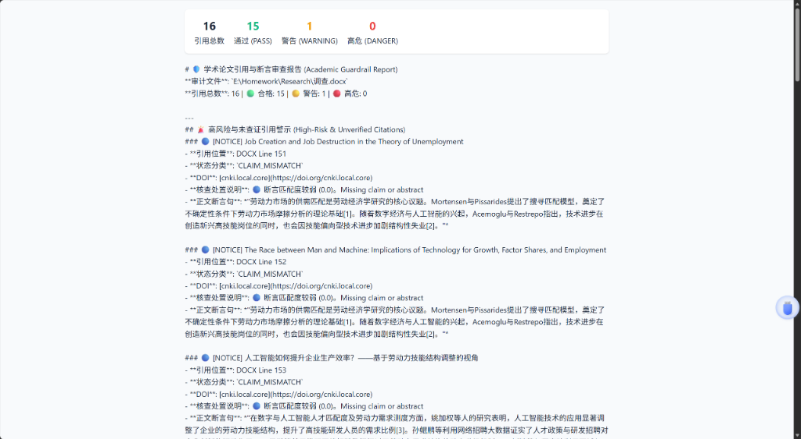

# 🛡️ Academic Guardrail Agent (`mcp-academic-guardrail`)

<p center="align">
  <b>End-to-End Academic Citation & Claim Consistency Verification Agent (MCP Server & CLI)</b><br>
  An open-source academic guardrail addressing <b>citation validity, retraction alerts, multilingual support, local reference extraction, and zero-shot claim alignment (Claim vs Content Match)</b>.
</p>

<p align="center">
  <b>English</b> | <a href="README_CN.md">中文</a>
</p>

<p align="center">
  
  
  
  
</p>

---

## 🖼️ Demo Preview

### 1. Browser UI Report Preview
Auto-launches your system browser to render a modern glassmorphism HTML report with summary cards, badges, and sentence-level context alignment (highlighted quotes represent **the exact matching sentence extracted directly from the reference abstract or local PDF**):



### 2. Interactive CLI Audit (`--open` / `-b`)
Run the audit command in your terminal to inspect claims and citations across public APIs and local reference files:

```bash
academic-guardrail audit "paper.docx" -r "./references" -b -o report.html
```

```
🛡️ Starting Audit: paper.docx
📚 Loaded Local Reference Store: Found 16 reference files
Extracted 16 citations & claims. Querying databases asynchronously...

                             🛡️ Academic Audit Summary                              
┌────────┬────────────────────────────┬──────────┬────────────────────────────┐
│ ID     │ Citation Text              │ Risk     │ Verification Summary       │
├────────┼────────────────────────────┼──────────┼────────────────────────────┤
│ cit_1  │ [1] MORTENSEN D T, ...     │ PASS     │ 🟢 Valid in Crossref.      │
│        │                            │          │ [Ref Sentence: "In..."]    │
│ cit_3  │ [3] Yao et al.             │ PASS     │ 🟢 Matched Local File      │
│        │ AI & Firm Productivity...  │          │ (Yao_Productivity.pdf).    │
│        │                            │          │ [Ref Sentence: "AI..."]    │
└────────┴────────────────────────────┴──────────┴────────────────────────────┘

Summary: Total: 16 | 🟢 PASS: 16 | 🟡 WARNING: 0 | 🔴 DANGER: 0
Report output to: report.html
🌐 Auto-launching default system browser...
```

---

## 🌟 Key Features

1. **Zero-Shot Multilingual Claim Alignment (`MultilingualFeatureExtractor`)**:
   - **Zero-Setup Cross-Lingual Matching**: Requires no pre-training or specialized domain dictionaries. Directly compares Chinese manuscript claims against English reference abstracts out of the box.
   - **Algorithm Details**: Under the hood, combines Token Stemming, academic synonym normalization, and multilingual subword N-Gram feature matching.
   - SciFact Gold Standard Benchmark Performance:
     - **Contradiction Interception (`CONTRADICTS` Class)**: Precision = **1.00 (100%)**, Recall = 0.75, **F1-Score = 0.86**
     - **Support Verification (`SUPPORTS` Class)**: Precision = 0.75, Recall = 0.61, **F1-Score = 0.67**
     - *(Weighted Average F1 over full SciFact dataset = 0.77)*
2. **Claim Entailment Mechanism**:
   - The system extracts inline citation claims from the manuscript text.
   - Fetches abstract or full-text paragraphs from public APIs or local reference files, detects reversed conclusions and distorted claims by resolving polarity conflicts via a `Polarity Antonym Graph`, and pinpoints the exact matching sentence from the reference source text.
3. **Sentence-Level Context Locator (`find_best_matching_sentence`)**:
   - Automatically splits abstracts/full-text into sentences and highlights the exact single sentence in the reference paper that best corresponds to the manuscript claim.
4. **Local Reference Paper Extractor (`--refs-dir` / `-r`)**:
   - Accepts user-supplied directories of reference PDFs, DOCX, or TXT files.
   - Scans multi-page PDF full text to perform sentence-level claim alignment when online APIs lack abstracts.
5. **Proxy & Rate Limit Resilience (`trust_env`)**:
   - Includes `trust_env=True` and OpenAlex Polite Pool headers to eliminate SSL timeouts and HTTP 429 rate limit issues.

---

## 📦 Installation & Setup

### 1. Dependencies

- **Python**: `>= 3.10`
- **Core Packages**:
  - `httpx` (Async HTTP requests with `trust_env` system proxy support)
  - `pypdf` & `python-docx` (Full-text parsing for local reference PDFs & DOCX manuscripts)
  - `rich` (Terminal console tables & colored card rendering)
  - `mcp` (Model Context Protocol 1.0.0 SDK)

### 2. Fast PyPI Installation (Coming Soon)

```bash
pip install academic-guardrail
```
> **Note**: The project is currently in active development. Please install from source for now. We will publish to PyPI shortly.

### 3. Install from Source

```bash
# 1. Clone the repository
git clone https://github.com/your-org/mcp-academic-guardrail.git
cd mcp-academic-guardrail

# 2. Editable install
pip install -e .
```

---

## 🚀 Quick Start

### 1. CLI Usage

Audit a paper manuscript and open the HTML report:
```bash
academic-guardrail audit manuscript.docx -b -o report.html
```

Audit with a local directory of reference papers (PDF/DOCX/TXT):
```bash
academic-guardrail audit manuscript.docx -r ./references -b -o report.html
```

Verify a single DOI or citation:
```bash
academic-guardrail verify "10.1109/CVPR.2016.90"
```

Run the SciFact NLI Claim Alignment Benchmark:
```bash
python benchmark_claims.py
```

### 2. MCP Server Setup (Antigravity / Cursor / Claude Desktop)

```json
{
  "mcpServers": {
    "academic-guardrail": {
      "command": "academic-guardrail-mcp"
    }
  }
}
```

---

## 📄 License

[MIT License](LICENSE)
